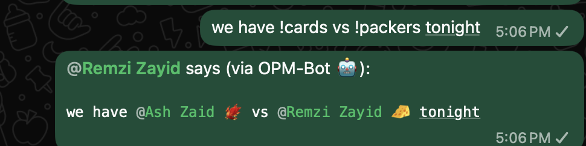
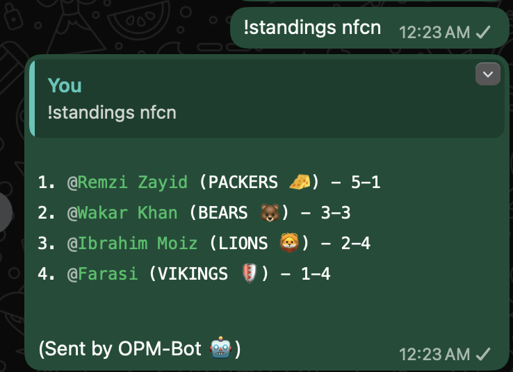
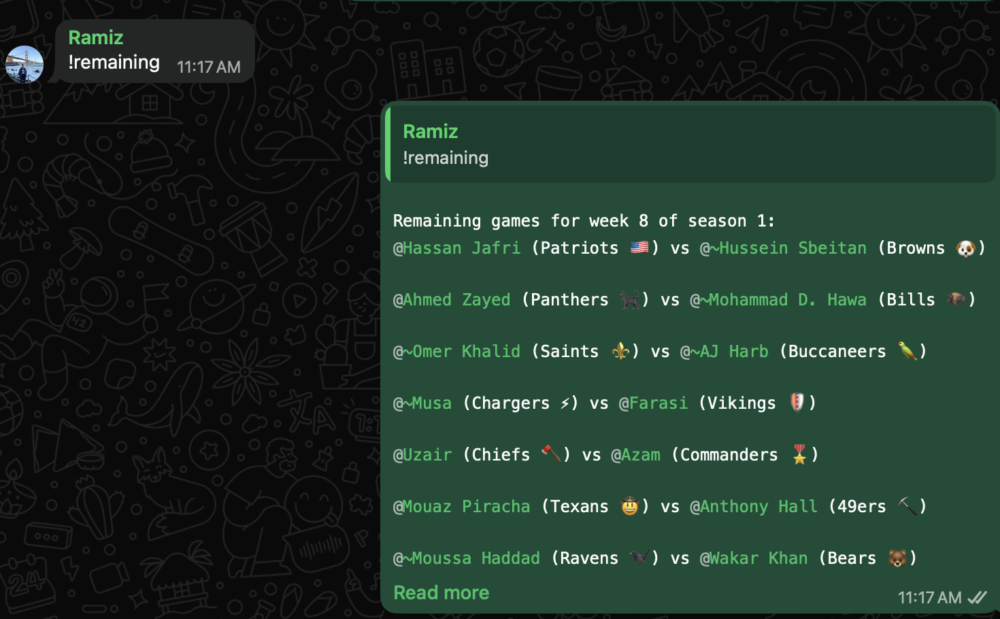

# OPM-Bot

## Overview

OPM-Bot is a small integration service used by the OPM Madden League to bridge three systems: the NeonSportz league API (for schedule, standings, matchups), WhatsApp (via a WAHA-compatible API), and optionally Discord. Its primary role is to accept WhatsApp messages (via a webhook), respond to lightweight commands, and send team- and league-related summaries or mentions into the league's main WhatsApp group.





## Basic Design

- Input: WAHA posts webhook payloads to the bot's /message endpoint.
- Processing: The bot parses incoming text messages and runs simple command handlers or rewrites messages that include team aliases.
- External services:
  - NeonSportz API for schedule, standings, and matchup lookups.
  - WAHA API for translating lids to phone numbers and for sending messages back to WhatsApp groups.
  - (Optional) Discord: listens for select messages to prepare WhatsApp summaries.
- Data: SQLite database (`data/opm.db`) stores team→owner mappings and the admin list. On first run the database is seeded from `player_teams.json`.

## Getting started
1. Clone the repo.
2. Copy the `.env.example` to `.env` and fill in values.
3. Ensure `player_teams.json` exists and contains the initial team→owner mappings (used for the one-time DB seed).
4. Run the bot and dependencies via `docker compose up --build` (alternatively, the app itself can be run locally via `yarn start` after installing dependencies).
5. The Waha container will output a QR code to scan with WhatsApp to link the bot.

The bot listens for incoming WAHA webhook POSTs (default in code: port 4000 at /message) — configure your WAHA instance to POST to that URL.

## Preferred tooling
This project uses Yarn in the Dockerfile and the development workflow favors Yarn. Use Yarn for installs and scripts unless you have a specific reason to use npm. The repository is compatible with npm but Yarn is recommended.

## Data: SQLite database
Team→owner mappings and the admin list are stored in a SQLite database (`data/opm.db`), which is volume-mounted so it persists across container restarts.

On first run, the `player_teams` table is seeded from `player_teams.json`. After that, all changes should go through the `!assign` command or directly via the SQLite CLI:

```sh
# From the host (volume-mounted)
sqlite3 ./data/opm.db

# Or from inside the container
docker exec -it opm-bot-app-1 sqlite3 /usr/src/app/data/opm.db
```

### Managing admins
Admins are the only users permitted to run the `!assign` command. Add or remove them directly in the database:

```sql
-- Add an admin
INSERT INTO admins (whatsapp_id) VALUES ('15555551234@c.us');

-- Remove an admin
DELETE FROM admins WHERE whatsapp_id = '15555551234@c.us';

-- List admins
SELECT * FROM admins;
```

## Usage: commands and behavior
Users interact with the bot in the WhatsApp main group. Commands are short, start with `!`, and are intentionally simple so they can be sent from mobile.

### General behavior:
- If a message contains embedded tokens with `!teamName`, the bot rewrites the message to include WhatsApp mentions for the matching teams and re-sends the rewritten message so the mentioned users are notified.
- If a message is a single `!command` token, the bot treats it as a command and replies with structured output (matchup, schedule, standings, etc.).

### Supported commands (summary)
- `!teamName` — Mention the team's owner; supports aliases (e.g., `!was`, `!commanders`).
- Embedded `!alias` tokens — Rewrites message replacing `!alias` with a mention + team emoji and sends it.
- `!opponent` — Looks up the sender's team and replies with the opponent for the current week.
- `!remaining` — Lists remaining (incomplete) games for the current week.
- `!schedule` — Shows the full schedule for the current week.
- `!standings <modifier>` — Displays standings; modifiers: `nfl`, `afc`, `nfc`, or division codes like `afce`, `nfcn`, etc.
- `!week` — Replies with the current week and stage from NeonSportz.
- `!assign` — (Admin only) Assigns a WhatsApp user to a team. See below.

### `!assign` command
Admins can assign or reassign team owners without any server access or restart. Any previous assignment for that WhatsApp user is automatically cleared.

**Single assignment:**
```
!assign teamName @user
!assign teamName self
```
Use `self` to assign yourself (since WhatsApp doesn't allow tagging yourself).

**Bulk assignment:**
```
!assign
teamName1 @user1
teamName2 @user2
```

Team names support the same aliases as other commands (e.g., `was`, `commanders`). The bot will reply with a per-line confirmation.

### Examples
- `!was` → bot replies with the mention for the WAS team owner and an emoji.
- `Great game !commanders vs !packers` → bot rewrites the message to include mentions for both teams and sends it so both owners are pinged.
- `!standings nfl` → bot posts standings for the full league.
- `!assign bengals self` → assigns the message sender as the Bengals owner.

## Operational notes
- Team→owner mappings are managed via `!assign` in the WhatsApp group — no server access or restart required.
- The SQLite database is stored in `./data/opm.db` on the host and persists across restarts and image rebuilds.
- The WAHA service must be reachable from the bot; for local testing you can run a WAHA container and configure the bot to call it.
- Error handling: network or API failures are logged; transient failures can be retried by re-sending the user's command.
